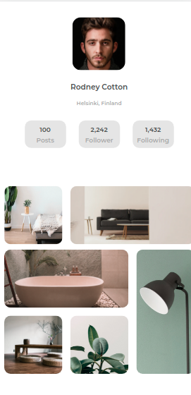

<!-- Please update value in the {}  -->

<h1 align="center">My Gallery Challenge</h1>

   Solution for a challenge from  <a href="http://devchallenges.io" target="_blank">Devchallenges.io</a>.

  <h3>
    <a href="https://github.com/tatranan/MyGalleryChallenge-DevChallenge">
      Demo
    </a>
     | 
    <a href="https://github.com/tatranan/MyGalleryChallenge">
      Solution
    </a>
     | 
    <a href="https://devchallenges.io/challenges/gcbWLxG6wdennelX7b8I">
      Challenge
    </a>
  </h3>

<!-- TABLE OF CONTENTS -->

## Table of Contents

- [Overview](#overview)
  - [Built With](#built-with)
- [Features](#features)
- [Contact](#contact)
- [Acknowledgements](#acknowledgements)

<!-- OVERVIEW -->

## Overview

- You can see demo in here
- I do the challenge to want practice more about HTML,CSS,JS.
- If my solution not suitable you can comment in my solution.

### Built With

<!-- This section should list any major frameworks that you built your project using. Here are a few examples.-->

- [HTML](https://fullstack.edu.vn/courses/html-css)
- [CSS](https://fullstack.edu.vn/courses/html-css)

## Features

 The [challenge](https://devchallenges.io/challenges/gcbWLxG6wdennelX7b8I) was to build a landing page following the given design.

## Acknowledgements

- [Flexbox in css](https://www.w3schools.com/css/css3_flexbox.asp)

## Contact

- GitHub [tatranan](https://github.com/tatranan/)
- Youtube [drio anden](https://www.youtube.com/channel/UC7CJBfb1bAIg6kCGmXwcoUQ/videos%257D)
